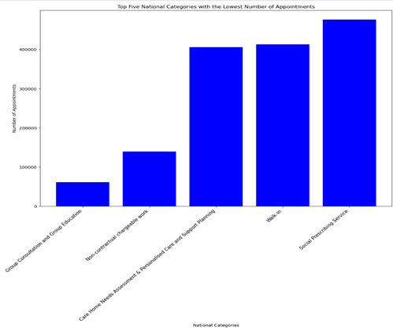
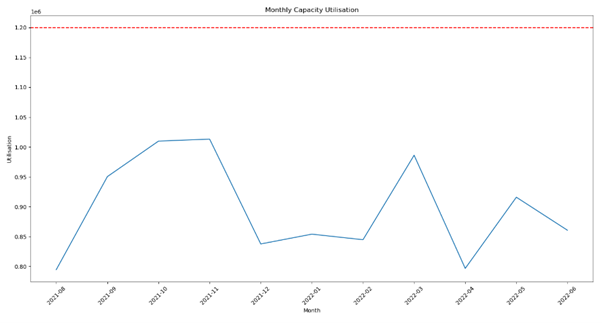

# NHS Diagnostic Analysis 

## Overview
This project aims to analyse data to evaluate the adequacy of staffing and capacity within NHS networks, as well as to assess the actual utilisation of resources. By leveraging both internal data on service utilisation and appointment details, alongside external data from sources such as Twitter (X), we aim to provide insights that will inform strategic planning and optimise resource allocation for the NHS.

## Business Background and Key Questions
The **National Health Service (NHS)**, England's publicly funded healthcare system, faces challenges in resource allocation due to an increasing population. This analysis aims to address these challenges by focusing on the following key areas:

- **Staffing and Capacity Evaluation**: Assess whether current staffing levels and healthcare capacity are sufficient to meet patient demand.
- **Actual Resource Utilisation**: Analyse the actual utilisation of resources, including service appointments, to identify inefficiencies and suggest improvements.
- **Service Demand and Patterns**: Understand the demand for different types of services, both by time and type, to support effective planning.
- **External Sentiment Analysis**: Leverage data from Twitter to understand public sentiment and feedback regarding NHS services.

## Data Cleaning and Preparation
### Steps Taken:
1. **Initial Data Exploration**
   - Imported the four datasets (`actual_duration`, `national_categories`, `appointments_regional`, and `tweets`) into Python.
   - Used descriptive statistics and metadata (`file_data.info()` and `file_data.describe()`) to perform a sense-check, ensuring the data's accuracy, consistency, and reliability.

2. **Handling Duplicates**
   - Investigated and removed duplicates across the datasets:
     - Found and removed **21,604 duplicate records** in the `actual_duration` dataset.
     - No duplicates were found in the remaining datasets, ensuring high data quality.

3. **Data Merging and Integration**
   - Merged datasets using an outer join to retain all rows, ensuring no data was excluded. This approach allowed us to maintain comprehensive information, even for unmatched entries between datasets.

4. **Outlier and Irrelevant Data Removal**
   - Removed irrelevant data and filtered outliers to ensure the integrity of the analysis and produce clear data visualisations.

## Data Analysis Approach
### Tools and Libraries
This analysis was conducted using **Python**.

#### Libraries Used
- **Pandas (`import pandas as pd`)**: 
  - For data manipulation, including grouping, aggregating, and merging.
  
- **NumPy (`import numpy as np`)**: 
  - For numerical operations and data normalisation.

- **Matplotlib (`import matplotlib.pyplot as plt`)**: 
  - For visualisations, such as bar charts, line graphs, and histograms.

- **Seaborn (`import seaborn as sns`)**: 
  - For statistical graphics, including heatmaps and pair plots.

- **Statsmodels (`import statsmodels.api as sm`, `import statsmodels.stats.api as sms`)**: 
  - For statistical modelling and hypothesis testing.

## Key Insights and Visualisation Summary

### Patterns, Trends, and Insights
1. **Appointments by Region**:
   - The dataset initially contained 106 locations. The **NHS North-West London ICB** recorded the highest number of appointments at **12,142,390**, followed by **NHS North-East London ICB** with **9,558,891** appointments.
   - Three of the top five locations with the highest number of appointments are situated in London, highlighting a regional concentration of healthcare demand.

   

2. **National Categories Analysis**:
   - **General Consultation Routine** had the highest number of appointments, followed by **General Consultation Acute**.
   - On the other hand, **Group Consultation** and **Group Education** had the lowest number of appointments, indicating potentially less demand or limited accessibility for these services.

   
   

3. **Seasonal Trends in Appointments**:
   - The data showed that **November 2021** recorded the highest number of appointments, followed by **October 2021** and **March 2022**. Notably, three of the top four months with the highest number of appointments fell in the autumn season (September to November).
   
   | Rank | Month          | No of Appointments  |
   |------|----------------|---------------------|
   | 1    | November 2021  | 30,405,070          |
   | 2    | October 2021   | 30,303,834          |
   | 3    | March 2022     | 29,595,038          |
   | 4    | September 2021 | 28,522,501          |

4. **Service Setting and Seasonal Influence**:
   - The graph below shows a rising trend in the number of appointments beginning in **August**, peaking in **November** for General Practice, followed by a secondary peak in **March**. A similar seasonal trend is observed across various service settings, suggesting a seasonal influence on healthcare demands.

   

   - The following chart further breaks down the number of appointments across different service settings by season, highlighting the increased demand for **General Practice** during **autumn** and **winter** compared to other service settings. This visualisation helps identify how seasonal variations affect different services and provides insight into when additional resources may be required.

   

5. **Context Types and Trends**:
   - **Care-Related Encounters** followed a similar trend to General Practice, with appointments increasing in **August** and peaking in **November** at **26,282,778**, followed by another peak in **March**.

   

6. **National Categories Over Time**:
   - Among the **National Categories**, **Structured Medication Review** recorded the highest number of appointments between **August 2021** and **June 2022**, followed by **Care Home Visit** and **Care Home Needs Assessment & Personalised Care and Support Planning**. These categories exhibited similar trends, with **March 2022** having the highest number of appointments and **August 2021** the lowest.

   

## Patterns and Predictions

### Key Findings on Resource Utilisation
1. **Correlation Between Appointment Time and Booking**:
   - A negative correlation was observed between the number of appointments and the time from booking to appointment. This trend suggests inefficiencies, particularly when appointments are scheduled at short notice, affecting effective resource allocation.

   

2. **Appointment Mode Utilisation**:
   - The most used appointment modes were **Face-to-Face** and **Telephone**, with a smaller proportion allocated to **Home Visits** and **Online Appointments**. This indicates that resource allocation should focus on prioritising these primary modes of service delivery.

   

3. **Missed Appointments (Did Not Attend - DNAs)**:
   - Approximately **4.55%** of patients (equivalent to **54,600** patients) did not attend their appointments. This represents a significant impact, leading to wasted resources and reducing accessibility for other patients. Immediate strategies are required to address this issue effectively.

   

### Findings on Staffing and Capacity
1. **Staff Utilisation**:
   - The daily appointment rates were below the NHS's recommended maximum capacity of **1,200,000** per day, indicating that current staffing levels are sufficient to meet existing demand.

   

2. **Distribution of Healthcare Professionals**:
   - A well-balanced distribution of healthcare professionals was observed across networks. This ensures comprehensive patient coverage; however, further examination may be required in specific roles to optimise care delivery.

   

## Recommendations
1. **Enhance Twitter Data Analysis**:
   - The lack of a time frame in the Twitter dataset limited the scope for deeper analysis. Adding a time frame could significantly improve the potential for robust sentiment analysis and trend evaluation.

2. **Reduce Missed Appointments**:
   - Implement targeted strategies, such as reminders and follow-ups, to reduce missed appointments and maximise resource utilisation.

3. **Prioritise Face-to-Face and Telephone Modes**:
   - Given the high utilisation of **Face-to-Face** and **Telephone** appointments, resource allocation and planning should prioritise these modes.

4. **Seasonal Demand Planning**:
   - The seasonal trends indicate a higher demand for appointments in autumn and early spring. Resource allocation should consider these peaks to ensure sufficient staffing and availability during these periods.

